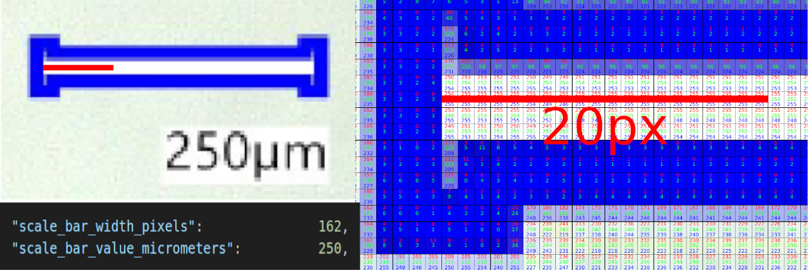

# RPA: Rock-Particle-Analyzer

RPA is a script designed to process microscopic images of rock particles and extract relevant data.

## Table of Contents

- [Introduction](#introduction)
- [Dependencies](#dependencies)
- [Features](#features)
- [Usage](#usage)
- [Contributing](#contributing)
- [Known Issues](#known-issues)
- [Donations](#donations)

## Introduction

Developed in response to a request from a university research project, this tool automates the process of measuring particle characteristics.

## Dependencies

Ensure you have [Python 3.6](https://www.python.org/downloads/) or higher installed.

To install the necessary dependencies, run the following command in your terminal from the project's root directory:
```bash
pip install -r requirements.txt
```

## Features

- Real-time Adjustable Contour Detection: 
     - Modify contour detection parameters on the fly for precise measurements.
- Particle Characteristics Calculation:
     - Minimum Feret Diameter
     - Maximum Feret Diameter
     - Roundness
- Excel Export: 
     - Particle data is automatically exported for further analysis.

## Usage

1. Configuration:
     - Adjust config.json to suit your needs.
     - The scale bar pixel width must be manually measured by the user and updated in config.json before running the script.
     
     
     
     

2. Running the script:

     - Execute the following command from the project's root directory:

     ```bash
     python3 main.py
     ```
     - Use the scrollbar to zoom in and adjust contour detection in real-time, ensuring proper contour alignment.
     

## Contributing

If you have any ideas, suggestions, or bug reports, please open an issue, submit a pull request or contact me directly.

## Known Issues

## Donations

Monero
```
884Pjeq7L7n7cCciVnjZuS9dbXj86GqkCKKes4REg9RK2cvhjRNZVUXHsr7WWS3cCtWag48N9ASJe5QzRoyWJM4VJEG7Gje
```
