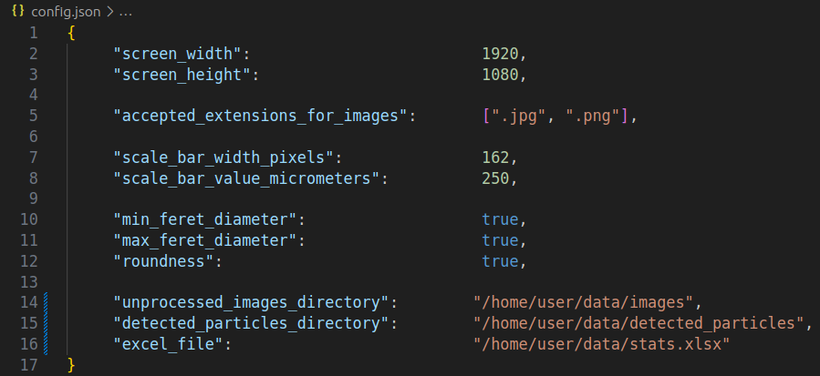

# Rock-Particle-Analyzer (RPA)

A Python script developed to automate data extraction from microscopic images of rock particles, by analyzing outlines of the particles and exporting the results to Excel for further analysis. Created to address the needs of a university research project and accelerate its process.

## Table of Contents

- [Introduction](#introduction)
- [Features](#features)
- [Dependencies](#dependencies)
- [Usage](#usage)
- [Contributing](#contributing)
- [Known Issues](#known-issues)
- [Donations](#donations)

## Introduction

Humans are about to return to the moon with the upcoming Artemis mission. To reduce costs, a large focus is set on using resources on the moon to build a base or build solar cells. This resource is called regolith, the fine powderlike substance that can be found on the surface of the moon. In order to test machines and manufacturing processes with this powder, simulants are produced on earth. These regolith simulants mimic the properties of various soil samples brought to Earth during the Apollo program. To verify the properties of the simulant and compare the simulants of different research institutes around the world, its properties need to be analyzed. By taking a large amount of microscopic pictures and analyzing the outline of the particles a lot of information can be extracted, like the Feret diameter or the roundness. This program helps to facilitate the process of analyzing those particles and getting values that can later be compared.

## Features

- Real-time Adjustable Contour Detection: 
     - Modify contour detection parameters on the fly for precise measurements.
     - Press `q` when the image processing window is focused to stop processing.
     - Press `e` when the image processing window is focused to display gathered data from Excel.
- Particle Characteristics Calculation:
     - Minimum Feret Diameter
     - Maximum Feret Diameter
     - Roundness
- Excel Export: 
     - Particle data is automatically saved to an Excel file upon contour click.

## Dependencies

Ensure you have [Python 3.6](https://www.python.org/downloads/) or higher installed.

To install the necessary dependencies, run the following command in your terminal from the project's root directory:
```bash
pip install -r requirements.txt
```

## Usage

1. Configuration:

     - Measure the scale bar's pixel width on the original image. 
     

     - Update the `config.json` file with the measurement to ensure accurate data extraction.
     
     
2. Running the script:

     - Execute the following command from the project's root directory:

     ```bash
     python3 main.py
     ```
     - Use the scrollbar to zoom in and adjust contour detection in real-time, ensuring proper contour alignment.
     

     - Once the contour is properly aligned, click on it. The data will be appeneded to Excel file and displayed in the console. Press `e` to display all gathered data from Excel file.
     

## Contributing

If you have any ideas, suggestions, or bug reports, please open an issue, submit a pull request or contact me directly.

## Known Issues

## Donations

Monero
```
884Pjeq7L7n7cCciVnjZuS9dbXj86GqkCKKes4REg9RK2cvhjRNZVUXHsr7WWS3cCtWag48N9ASJe5QzRoyWJM4VJEG7Gje
```
